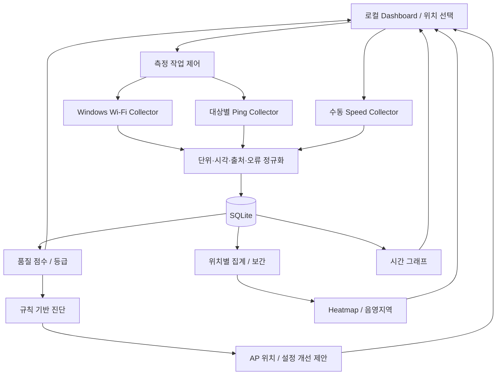

# 시스템 구조와 초기 데이터 설계

## 구성도

## 모듈 책임

| 경로 | 책임 |
|---|---|
| collectors | OS 명령·API 접근, 유한 타임아웃, 측정 결과 반환 |
| storage | 트랜잭션·스키마·조회, UI와 독립 |
| analysis | 품질 점수, 공간 집계, 원인 후보 판별 |
| visualization | 상태·그래프·평면도·Heatmap 표시 |
| optimization | 진단 근거에 따른 개선 제안 |
| __main__.py | 실행 진입점, 현재는 개발 환경 확인만 제공 |

수집 → 정규화 → 저장 → 분석으로 흐른다. 시각화가 추천 엔진의 필수 선행 단계는 아니다.
긴 작업은 UI 스레드 밖에서 실행하고 작업 큐로 결과를 전달한다.
SQLite 쓰기는 한 경로로 직렬화하며 속도 측정은 별도 작업으로 관리한다.

## 데이터 모델 초안 (5주차 확정)

- Space: ID, 이름, 평면도 경로, 폭·높이, 좌표 단위.
- Location: ID, space_id, 이름, x, y. 좌상단 원점·오른쪽 x 증가·아래쪽 y 증가.
- AP: ID, BSSID, 표시명. SSID는 측정 시점에도 저장한다.
- Measurement: ID, UTC 시각, session_id, location_id(선택), AP ID(선택),
  인터페이스, SSID, BSSID, signal_percent, rssi_dbm, rssi_source,
  channel, frequency_mhz, band, 상태, 오류 코드.
- PingResult: measurement_id, 대상 주소, 대상 종류(gateway/external),
  sent, received, min/avg/max RTT(ms), loss_percent, 시작·종료 시각, 상태.
- SpeedResult: ID, session_id, location_id, BSSID, 서버,
  download/upload Mbps, 시작·종료 시각, 상태.
- AnalysisResult: measurement_id 또는 집계 ID, 기준 버전, 점수, 등급, 사용 지표,
  진단 규칙 ID와 근거.

별도 속도 측정 결과를 최신 Wi-Fi 샘플에 무조건 붙이지 않는다. 측정 시각과 AP를 확인한다.
측정값은 nullable이며 상태는 ok / disconnected / unavailable / permission_denied /
timeout / error를 기본 후보로 한다.

## 설계 제약

- 2주차 netsh 연동을 시작점으로 하되 언어별 출력 파싱을 분리한다.
- 실제 RSSI 확보가 필요하면 Native Wi-Fi API 적용을 검토한다.
- 대역은 가능한 경우 주파수 또는 명시된 대역에서 결정한다. 불명확한 채널은 unknown 처리한다.
- 보간된 영역과 실측 위치를 구분하고 측정 범위 밖을 확정된 커버리지로 표시하지 않는다.
- AP 이동 추천은 정성적인 방향 제안부터 구현한다. 벽·전파 모델 없는 최적 좌표 계산은 추가 범위다.
