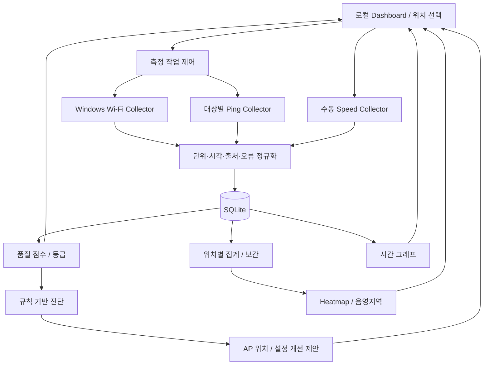

# 시스템 구조와 초기 데이터 설계

## 구성도

```mermaid
flowchart TD
    UI[로컬 Dashboard / 위치 선택] --> Scheduler[측정 작업 제어]
    Scheduler --> WiFi[Windows Wi-Fi Collector]
    Scheduler --> Ping[대상별 Ping Collector]
    UI --> Speed[수동 Speed Collector]
    WiFi --> Normalize[단위·시각·출처·오류 정규화]
    Ping --> Normalize
    Speed --> Normalize
    Normalize --> DB[(SQLite)]
    DB --> Quality[품질 점수 / 등급]
    DB --> Spatial[위치별 집계 / 보간]
    Quality --> Rules[규칙 기반 진단]
    Spatial --> Heatmap[Heatmap / 음영지역]
    Quality --> UI
    Heatmap --> UI
    DB --> Graph[시간 그래프]
    Graph --> UI
    Rules --> Recommend[AP 위치 / 설정 개선 제안]
    Recommend --> UI
```

## 모듈 책임

| 경로 | 책임 |
|---|---|
| collectors | OS 명령·API 접근, 유한 타임아웃, 측정 결과 반환 |
| storage | 트랜잭션·스키마·조회, UI와 독립 |
| visualization/history.py | 별도 읽기 전용 연결과 작업자로 기록 목록·상세 조회 |
| analysis | 품질 점수, 공간 집계, 원인 후보 판별 |
| visualization | 상태·그래프·평면도·Heatmap 표시 |
| optimization | 진단 근거에 따른 개선 제안 |
| __main__.py | 환경 확인·Wi-Fi 조회·수동 측정·자동 수집 CLI 진입점 |

수집 → 정규화 → 저장 → 분석으로 흐른다. 시각화가 추천 엔진의 필수 선행 단계는 아니다.
긴 작업은 UI 스레드 밖에서 실행하고 작업 큐로 결과를 전달한다.
SQLite 쓰기는 한 경로로 직렬화한다. 속도 측정은 요청된 수집 주기에 순차 실행한다.

## 데이터 모델 v1 (2026-09-29 확정)

상세 필드·관계·상태·저장 규칙은 [SQLite 저장 구조 v1](database-design.md)을 기준으로 한다.

- Space → Location: 공간과 고정 좌표. 위치를 지정하지 않은 측정도 허용한다.
- Session → Measurement: 실행 설정·실측/예제 구분과 호출별 원본 결과를 보존한다.
- AP → Measurement: BSSID로 식별하며 관측 당시 SSID·BSSID도 측정 행에 남긴다.
- Measurement → PingResult: 게이트웨이·외부 대상별 계수·RTT·손실·오류를 저장한다.
- Measurement → SpeedResult → SpeedTransfer: 해당 호출의 속도 결과와 방향별 실패를 보존한다.
- 품질 분석 결과는 이후 주차에 추가한다. DB 생성·저장 API와 Collector 자동 저장 연결을 구현했다.

측정값 누락은 NULL로 표현하고 전체 상태와 개별 측정 상태를 구분한다.
속도 결과를 다른 호출의 최신 Wi-Fi 샘플에 붙이지 않으며 연결 변경 경고를 함께 보존한다.

## 설계 제약

- 2주차 netsh 연동을 시작점으로 하되 언어별 출력 파싱을 분리한다.
- 실제 RSSI 확보가 필요하면 Native Wi-Fi API 적용을 검토한다.
- 대역은 가능한 경우 주파수 또는 명시된 대역에서 결정한다. 불명확한 채널은 unknown 처리한다.
- 보간된 영역과 실측 위치를 구분하고 측정 범위 밖을 확정된 커버리지로 표시하지 않는다.
- AP 이동 추천은 정성적인 방향 제안부터 구현한다. 벽·전파 모델 없는 최적 좌표 계산은 추가 범위다.
