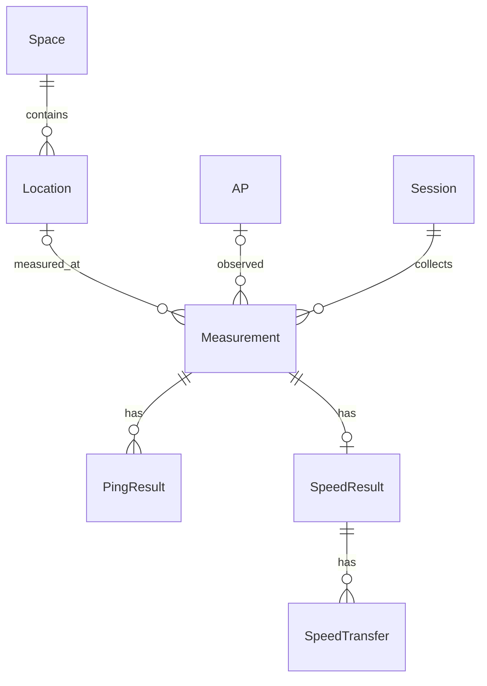

# SQLite 저장 구조 v1

설계 확정일: 2026-09-29. 테이블 생성·저장 API, Collector 자동 저장, 조회 API·CLI·GUI 구현 완료.
현재 `measurement.py`, `collector.py`, `collectors/`의 반환 구조를 기준으로 한다.

## 저장 단위와 관계

한 번의 `measure_quality()` 호출 결과를 하나의 Measurement로 저장한다.
자동 수집과 수동 측정에 같은 구조를 사용한다. 속도 포함 측정도 같은 호출에 속한 결과로 연결한다.
기본 DB 경로는 프로젝트의 `data/wifi_optimizer.sqlite3`이며 경로를 명시적으로 바꿀 수 있게 한다.

Location과 AP는 측정 실패·위치 미지정 시 없어도 된다. PingResult는 대상별 최대 2개,
SpeedResult는 호출당 최대 1개, SpeedTransfer는 방향별 최대 2개다.
SSID는 AP 식별자로 쓰지 않고 관측 당시 값을 Measurement에 남긴다.
AP는 BSSID로 구분하는 무선 접속 지점이며, 물리적 공유기 한 대를 뜻하지 않는다.

## 테이블 및 필드

아래에서 `?`는 NULL 허용이다. ID는 Session의 UUID TEXT를 제외하고 INTEGER PRIMARY KEY다.
문자열·시각·JSON은 TEXT, 계수는 INTEGER, 측정값·좌표는 REAL을 사용한다.
별도 표시가 없는 필드는 필수다. 필드 목록의 ID/FK는 아래 관계 규칙을 따른다.

| 테이블 | 필드 | 역할 |
|---|---|---|
| Space | id, name, floorplan_path?, width?, height?, coordinate_unit | 공간과 좌표 기준. 단위는 `m` 또는 `px`, 크기는 지정 시 양수 |
| Location | id, space_id, name, x, y | 공간 내 고정 측정 위치. 좌상단 원점, 오른쪽 x·아래쪽 y 증가, 좌표는 0 이상 |
| AP | id, bssid, display_name? | BSSID는 소문자 콜론 형식으로 정규화하고 UNIQUE |
| Session | id, mode, started_at, finished_at?, config_json, data_kind | mode는 `monitor`/`manual`, data_kind는 `real`/`example`. config_json에 요청 인터페이스·Ping 대상·횟수·대기 간격 등을 기록 |
| Measurement | id, session_id, sequence, started_at, finished_at, duration_seconds?, location_id?, repeat_group_id?, ap_id?, status, error_code?, error?, warnings_json, raw_result_json | 호출 단위 결과와 원본. sequence는 세션 내 양의 정수, repeat_group_id는 위치 반복 측정 그룹용 TEXT |
| Measurement (Wi-Fi 필드) | wifi_timestamp?, interface?, interface_guid?, interface_description?, wifi_state?, ssid?, bssid?, signal_percent?, rssi_dbm?, rssi_source?, channel?, band?, wifi_warnings_json | 시작 시 관측한 Wi-Fi 스냅샷. SSID·BSSID는 AP 표시명 수정과 무관하게 보존 |
| Measurement (네트워크 필드) | network_interface?, network_index?, source_ip?, gateway? | 해당 호출에 사용한 IPv4 경로 |
| PingResult | id, measurement_id, target_kind, target?, source_ip?, started_at?, finished_at?, timeout_ms?, status, attempted?, sent?, received?, send_errors?, min_ms?, avg_ms?, max_ms?, packet_loss_percent?, error?, samples_json | target_kind는 `gateway`/`external`. 개별 프로브도 JSON으로 보존 |
| SpeedResult | id, measurement_id, status, server?, source_ip?, method?, started_at?, finished_at?, note?, error? | 요청된 속도 측정의 메타데이터. 미요청이면 행 없음 |
| SpeedTransfer | id, speed_result_id, direction, status, mbps?, bytes?, seconds?, server_location?, error? | direction은 `download`/`upload`. 방향별 성공·실패와 서버 위치 보존 |

JSON 필드에 NULL은 쓰지 않는다. 경고·프로브 목록 기본값은 `[]`, 설정 기본값은 `{}`다.
raw_result_json은 실제 반환 결과 전체를 JSON으로 직렬화하며 필수다.
인터페이스나 시각 등 원본에 없는 값은 추측해서 채우지 않는다.
현재 수집하지 않는 frequency_mhz와 아직 계산하지 않는 AnalysisResult는 v1에 넣지 않는다.
품질 점수·진단 테이블은 기준 버전이 정해지는 이후 주차에 마이그레이션으로 추가한다.

## 현재 반환값 매핑

| 입력 | 저장 대상 및 처리 |
|---|---|
| 최상위 started_at, finished_at, status, error, warnings | Measurement 동명 필드. error 미존재 시 NULL, warnings 기본 `[]` |
| Collector의 sequence, duration_seconds | Measurement 동명 필드. 수동 측정은 sequence=1, 소요 시간이 없으면 NULL |
| wifi.timestamp/interface/guid/description/state | wifi_timestamp/interface/interface_guid/interface_description/wifi_state |
| wifi.ssid/bssid/signal_percent/rssi_dbm/rssi_source/channel/band | Measurement 동명 필드. 유효 BSSID가 있으면 AP 조회 또는 생성 후 ap_id 연결 |
| wifi.warnings | wifi_warnings_json. 최상위 warnings와 별개로 보존 |
| network.interface/index/source_ip/gateway | network_interface/network_index/source_ip/gateway |
| ping.gateway, ping.external | 존재하는 키마다 PingResult 1개. samples는 samples_json, 나머지는 동명 필드 |
| speed.status=not_requested | SpeedResult 생성 안 함. 미요청 상태 자체는 raw_result_json에 남김 |
| 그 외 speed | SpeedResult 1개, 존재하는 download/upload마다 SpeedTransfer 1개 |
| location_id, repeat_group_id, session_id | 저장 호출의 문맥으로 전달. 측정 시작 시 값을 고정해 도중 UI 변경이 결과에 영향을 주지 않게 함 |

Session은 Collector가 생성하고 저장 결과의 `storage.session_id`로 전달한다.
위치 문맥은 아직 GUI에서 지정하지 않으므로 자동 측정에서는 NULL이다.
현재 Collector의 sequence는 재시작해도 증가한다. 세션은 Collector 인스턴스 생성부터 close까지로
정의하고 중지·재시작에도 같은 ID를 유지한다. 앱 재실행 또는 새 Collector 생성은 새 UUID를 쓴다.
수동 호출은 호출당 세션 하나를 만들고 종료한다. 비정상 종료 세션의 finished_at은 NULL로 둔다.

## 실패·누락·연결 변경

- Measurement.status는 현재 코드의 `ok`, `partial`, `error`, `cancelled`를 그대로 쓴다.
- PingResult.status는 `ok`, `partial`, `no_reply`, `error`, `unavailable`이다.
  게이트웨이 부재는 unavailable 행으로 남기고, 취소로 실행되지 않은 대상은 행을 만들지 않는다.
- SpeedResult.status는 `ok`, `partial`, `error`, SpeedTransfer.status는 `ok`, `error`다.
  부분 실패 때 성공한 방향의 값을 지우거나 실패한 방향을 0으로 채우지 않는다.
- RSSI·RTT·속도 등 미측정 값은 NULL이다. 실제 0과 구분한다. 숫자는 유한한 값만 허용한다.
  신호·손실률은 0~100, 채널은 1~233, 계수·RTT·Mbps·바이트·시간은 0 이상이다.
  Ping 계수가 모두 있으면 received ≤ sent ≤ attempted, sent + send_errors = attempted다.
  sent=0이면 손실률은 NULL, received=0이면 RTT 세 값은 NULL이다.
- measure_quality는 WifiMeasurementError.code를 error_code로 반환한다. 저장 계층에서 오류 문장을
  분석해 코드를 추정하지 않는다. 코드가 없는 기존 결과의 error_code는 NULL로 둔다.
  전체 측정 상태와 상세 오류 코드는 별개다.
- 현재 측정 종료 시 연결 변경은 경고 문자열로만 남고 종료 AP 스냅샷은 반환되지 않는다.
  그 한계를 그대로 보존하며 다른 AP에서 얻은 것으로 보정하지 않는다. 초기 분석은 warnings가
  있는 호출을 기본 집계에서 제외하고 시작 AP가 전체 호출 동안 유지됐다고 단정하지 않는다.
- 기본 집계는 대상 지표가 유효한 결과만 사용한다. Ping 대상·AP·대역·위치가 다른 표본은 구분한다.
  전체 status가 partial이어도 유효한 개별 지표는 별도로 조회할 수 있다.

## 키·조회·변경 규칙

- 모든 FK는 참조 무결성을 적용하고 삭제는 RESTRICT한다. v1에는 자동 삭제·보관 기간 정책이 없다.
- UNIQUE: AP(bssid), Measurement(session_id, sequence), PingResult(measurement_id, target_kind),
  SpeedResult(measurement_id), SpeedTransfer(speed_result_id, direction).
- 중복 저장은 같은 세션·순번의 기존 결과를 덮어쓰지 않는다. 같은 원본·위치 문맥이면 기존 ID를
  반환하고, 내용이 다르면 충돌 오류를 보고한다.
- Measurement 인덱스: (started_at, id), (ap_id, started_at, id), (location_id, started_at, id),
  (repeat_group_id). Location(space_id)와 Measurement의 세션 UNIQUE 인덱스도 사용한다.
- 시간 필터는 UTC 기준 `from <= started_at < to`, 기본 최신순 `(started_at DESC, id DESC)`이다.
  조회는 limit을 받으며 AP·위치·세션 필터를 조합할 수 있게 한다.
- 조회 연결은 읽기 전용이며 DB를 생성하거나 스키마를 변경하지 않는다. 목록은 실측만 기본 조회하고
  예제/전체를 명시적으로 선택할 수 있다. limit은 1~500, 기본 100이며 페이지 이동은 마지막 행의
  (started_at, id)보다 이전인 기록을 조회한다. 개별 ID 상세 조회는 종류와 무관하게 해당 기록을 반환한다.
- 모든 시각은 고정 6자리 소수초를 가진 UTC ISO 8601 `YYYY-MM-DDTHH:MM:SS.ffffff+00:00`으로
  정규화한다. 문자열 비교 순서와 시간 순서를 일치시키고 화면에서만 로컬 시각으로 변환한다.
- 과거 측정이 가리키는 Location 좌표와 Space의 단위·크기·평면도 기준은 변경하지 않는다.
  위치 이동이나 평면도 기준 변경 시 새 레코드를 만들어 과거 기록의 의미를 유지한다.

## 저장 처리와 스키마 관리

1. DB를 열 때 연결별 foreign_keys=ON과 busy_timeout=5000을 설정한다.
   스키마 버전은 PRAGMA user_version으로 관리하고 최초 v1 생성 후 1로 기록한다.
   더 높은 버전의 DB는 수정하지 않고 지원 불가 오류를 표시한다.
2. DB 쓰기는 측정 작업자에서 순차 수행하고 해당 스레드에서 연결을 생성·종료한다.
   close 시 측정 작업자 종료 후 별도 종료 작업자가 자신의 연결로 세션 종료를 기록한다.
   두 작업자는 동시에 쓰지 않는다. UI 조회는 별도 연결을 사용한다.
3. AP 조회/생성, Measurement, Ping·속도 하위 행을 하나의 트랜잭션으로 저장한다.
   하위 행 실패 시 전체 롤백해 불완전한 측정 기록을 만들지 않는다.
4. 저장은 화면용 결과 큐에 publish하기 전에 수행한다. 현재 큐는 최대 100개 이후 오래된 항목을
   버리므로 큐 소비 여부에 영속 저장을 의존시키지 않는다.
5. 저장 실패는 측정 실패와 구분해 로그와 UI/CLI에 명시한다. 측정 결과는 화면에 전달하되
   저장 성공으로 표시하지 않는다. v1에서는 실패 결과의 영구 재시도 큐를 제공하지 않는다.
6. 정상 종료는 진행 중인 측정·저장 처리를 마친 뒤 세션 종료 시각을 기록하고 DB 연결을 닫는다.
   DB와 원본 JSON은 로컬에 두며 기본 data 디렉터리 전체는 기존 Git 제외 규칙을 따른다.

## 다음 단계의 인수 기준

구현 단계에서 다음 사례를 검증한다. 설계 문서 작성만으로 검증 완료로 표시하지 않는다.

- 정상 측정 저장 후 DB를 닫고 다시 열어 시간·AP·위치별로 조회한다.
- Wi-Fi 실패, 게이트웨이 부재, Ping 전송 실패·100% 손실, 속도 한 방향 실패,
  미요청 속도, 도중 취소를 저장하고 NULL과 상태가 보존되는지 확인한다.
- 같은 세션·순번을 재저장해 중복이 생기지 않는지, 다른 내용은 충돌하는지 확인한다.
- 하위 행 저장 실패 시 AP 생성까지 롤백되는지 확인한다.
- UI 큐 초과와 무관하게 DB 기록이 유지되는지, DB 쓰기 실패가 별도로 표시되는지 확인한다.
- 중지·재시작과 앱 재실행의 세션/순번 규칙, 동일 시각의 안정적인 조회 순서를 확인한다.

5주차 진행: 저장 구조·스키마·저장 API·Collector 연결·조회 구현 및 실환경 검증 완료.
현재 검증 범위와 사용법은 [5주차 진행 현황](week05-status.md)을 참조한다.
